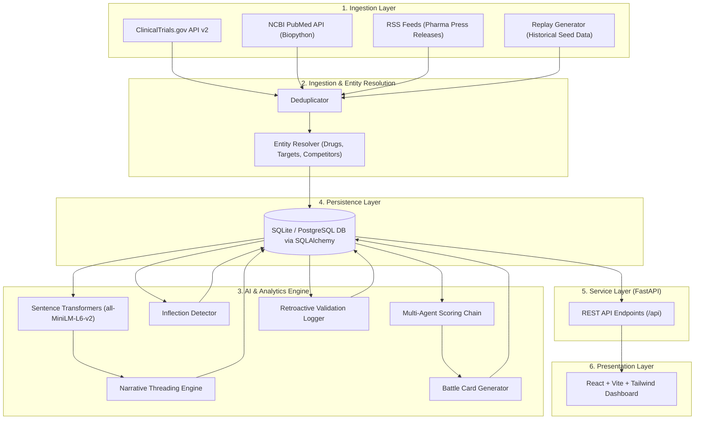

# MetaRadar — Competitive Intelligence & Operational Exposure Routing Engine

<p align="center">
  
  
  
  
  
  
</p>

> **MetaRadar** transforms noisy, fragmented pharmaceutical market signals—such as clinical trial site modifications, patent filings, medical research abstracts, and supply chain developments—into structured, prioritized, and action-routed competitive intelligence tailored for enterprise pharma strategy (e.g., benchmarking Novo Nordisk against Eli Lilly, Roche, Viking, Amgen, and Pfizer).

---

## 🎯 Executive Overview

Modern pharmaceutical competitive intelligence suffers from signal noise and fragmented data across clinical registries, medical literature, and press releases. **MetaRadar** bridges the gap between raw data collection and operational execution by:
1. **Filtering Noise**: Scoring signals using multi-agent NLP pipelines (`Scout` → `Analyst` → `Strategist`).
2. **Quantifying Exposure**: Mapping signals against corporate franchises (e.g., *Obesity*, *Type 2 Diabetes*) with transparent exposure calculations and strict financial guardrails.
3. **Automating Action**: Routing intelligence directly to internal action desks (*Market Access*, *Commercial Strategy*, *BD&L*, *Medical Affairs*).
4. **Predicting Inflections**: Detecting velocity spikes ($\ge 2.0\sigma$) in competitor activity to deliver early warnings before public readouts.

---

## 🚀 Key Features & Dashboard Modules

### 1. 📡 Radar & Signals Feed (`RadarTimeline.jsx` & `AlertFeed.jsx`)
- **Interactive Scatter Timeline**: Plot market signals across time and impact levels with flexible period filters (`1M`, `3M`, `6M`, `All Time`, Custom Date Range).
- **Scored Alert Feed**: Real-time signal feed categorized by threat level (`High`, `Medium`, `Low`) and tagged with relevant **Exposure Badges**.
- **Transparent Multi-Agent Trace**: Modal drill-down revealing the 4-step reasoning chain:
  - **Scout Agent**: Entity extraction, data normalization, and source validation.
  - **Analyst Agent**: Contextual impact evaluation and mechanism-of-action comparison.
  - **Strategist Agent**: Counter-positioning options and threat assessments.
  - **Exposure & Routing**: Automated franchise overlap calculation and desk routing.

### 2. 🔀 Operational Exposure & Routing Queue (`RoutingQueue.jsx`)
- **Franchise Overlap Detection**: Replaces abstract relevance scores with specific franchise mappings (`Obesity`, `Type 2 Diabetes`, `Both`).
- **Automated Internal Desk Routing**: Directs verified alerts to targeted internal business units:
  - 🏛️ **Market Access**: Pricing, reimbursement, and coverage strategy.
  - 📊 **Commercial Strategy**: Sales force allocation and market positioning.
  - 🤝 **BD&L**: Licensing, acquisitions, and strategic partnerships.
  - 🔬 **Medical Affairs**: Clinical trial design and Key Opinion Leader (KOL) engagement.
- **Strict Financial Guardrails**: Enforces zero fabrication of unverified financial figures, requiring explicit source citations for all revenue and valuation estimates.

### 3. 🧵 Narrative Threading Engine (`StoryTimeline.jsx`)
- Vector embedding-driven narrative clustering powered by `sentence-transformers` (`all-MiniLM-L6-v2`) and cosine similarity.
- Connects disparate, weak market signals into unified strategic threat threads tracking multi-month competitor trajectories.

### 4. 📈 Inflection Velocity Monitor (`InflectionMonitor.jsx`)
- Dual-axis composed visualization tracking weekly mention volume against 3-week rolling means.
- Highlights statistical anomaly velocity spikes ($\ge 2.0\sigma$ threshold line).
- Includes multi-period inspection selectors (`4W`, `8W`, `12W`, `ALL`).

### 5. ⚔️ Competitor Battle Cards (`BattleCards.jsx`)
- **Host Franchise Baseline**: Dedicated Novo Nordisk benchmark section positioned above active competitor profiles.
- **Competitor Profiles**: Deep dives into Eli Lilly, Roche, Viking Therapeutics, Amgen, and Pfizer.
- Covers lead pipeline assets, developmental stages, recent strategic moves, and tactical counter-measures.

### 6. ⏱️ Early Warning Track Record (`RetroactiveValidation.jsx`)
- Historical case study validating MetaRadar's **24-day predictive lead time** prior to major public Phase 3 clinical readouts.
- Backed by verified source citations (ClinicalTrials.gov `NCT05672836` and Eli Lilly IR press announcements).

---

## 🏛️ System Architecture



---

## 🛠️ Tech Stack & Key Libraries

| Component | Technology | Description |
| :--- | :--- | :--- |
| **Backend Framework** | [FastAPI](https://fastapi.tiangolo.com/) + [Uvicorn](https://www.uvicorn.org/) | High-performance asynchronous REST API server |
| **AI & Embeddings** | `sentence-transformers` (`all-MiniLM-L6-v2`), `scikit-learn` | Vector embeddings, semantic similarity, and clustering |
| **Bioinformatics** | `biopython`, `feedparser` | Medical literature fetching (PubMed) and press release ingestion |
| **Database & ORM** | SQLAlchemy, SQLite / PostgreSQL | Relational schema persistence and object-relational mapping |
| **Data Validation** | Pydantic v2 | Strict schema validation and serialization |
| **Testing** | Pytest | Unit and integration test suite |
| **Frontend Framework** | React 18 + [Vite 5](https://vitejs.dev/) | Fast single-page web application architecture |
| **UI & Styling** | Tailwind CSS, Lucide Icons, Recharts | Dynamic charts, modern styling, and responsive layout |

---

## 📂 Repository Structure

```
AUG-HACK/
├── backend/
│   ├── app/
│   │   ├── agents/          # Multi-agent scoring & reasoning chain
│   │   ├── analytics/       # Inflection detection, narrative threading, battle cards
│   │   ├── exposure/        # Franchise overlap & desk routing logic
│   │   ├── ingestion/       # ClinicalTrials, PubMed, RSS, deduplication & entity resolution
│   │   ├── security/        # API security & authentication helpers
│   │   ├── config.py        # Application configuration
│   │   ├── database.py      # SQLAlchemy models & DB connection setup
│   │   ├── main.py          # FastAPI application entrypoint & REST routes
│   │   └── schemas.py       # Pydantic data schemas
│   ├── tests/               # Pytest suite (API & exposure routing tests)
│   ├── metaradar.db         # SQLite database file
│   └── requirements.txt     # Python dependencies
├── frontend/
│   ├── src/
│   │   ├── api/             # Frontend API client
│   │   ├── components/      # React UI components (Timeline, Routing, BattleCards, etc.)
│   │   ├── App.jsx          # Main Dashboard application shell
│   │   ├── index.css        # Tailwind CSS imports & global styles
│   │   └── main.jsx         # React application entrypoint
│   ├── package.json         # Node.js dependencies & scripts
│   ├── tailwind.config.js   # Tailwind design tokens & configuration
│   └── vite.config.js       # Vite build configuration
├── architecture.md          # Technical architectural specification
└── README.md                # Project documentation
```

---

## 🔌 API Endpoints Summary

| Endpoint | Method | Description |
| :--- | :--- | :--- |
| `/api/health` | `GET` | Health check & system status |
| `/api/signals` | `GET` | Retrieve paginated signals with filters (competitor, threat, period) |
| `/api/signals/{id}/trace` | `GET` | Fetch multi-agent reasoning trace (`Scout` → `Analyst` → `Strategist`) |
| `/api/threads` | `GET` | Fetch narrative thread clusters |
| `/api/inflections` | `GET` | Fetch trend inflections and z-score anomaly metrics |
| `/api/battle-cards` | `GET` | Retrieve competitor battle cards and host baseline |
| `/api/validation-report` | `GET` | Fetch early warning track record & case study data |
| `/api/ingest/trigger` | `POST` | Trigger multi-source live ingestion pipeline |

---

## 💻 Quick Start Guide

### Prerequisites
- **Python**: `3.11` or higher
- **Node.js**: `18.0` or higher (with `npm`)

### 1. Backend Setup

```bash
# Navigate to the backend directory
cd backend

# Install Python dependencies
pip install -r requirements.txt

# Start the FastAPI server
python -m uvicorn app.main:app --port 8000 --reload
```
- API Base URL: `http://localhost:8000`
- Interactive API Docs (Swagger UI): `http://localhost:8000/docs`

### 2. Frontend Setup

```bash
# Navigate to the frontend directory
cd frontend

# Install npm dependencies
npm install

# Run the development server
npm run dev
```
- Web Application UI: `http://localhost:5173`

---

## 🧪 Running Unit Tests

To execute the Pytest suite covering exposure calculations, team routing rules, and financial guardrails:

```bash
cd backend
python -m pytest tests/test_exposure_routing.py
```

Or run all backend tests:

```bash
cd backend
python -m pytest tests/
```

---

## 📜 License & Acknowledgments

Built for pharma competitive intelligence benchmarking and strategic risk management.

