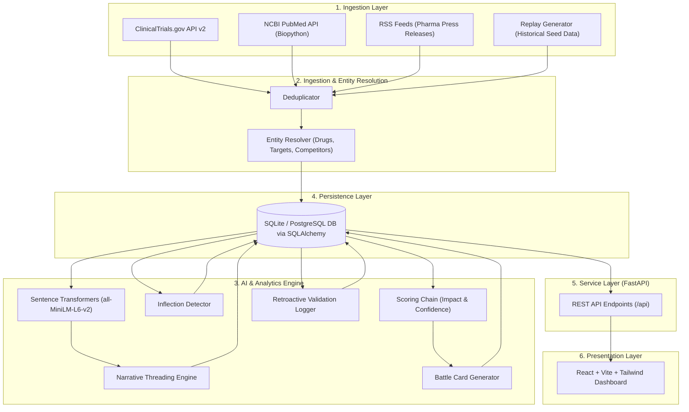

# MetaRadar: System Architecture & Technical Specifications

MetaRadar is an autonomous competitive intelligence platform for the pharmaceutical and biotechnology sectors. It ingests multi-channel signals (clinical trials, peer-reviewed literature, press releases), performs semantic embedding and narrative clustering, detects strategic trend inflections, and automatically generates dynamic competitor battle cards.

---

## 1. System Overview & Architecture Diagram



---

## 2. Layered Architecture Breakdown

### 2.1 Ingestion & Normalization Layer (`backend/app/ingestion/`)
* **`clinicaltrials_client.py`**: Interacts with the ClinicalTrials.gov API v2 to fetch real-time clinical trial updates, phase advancements, and study outcomes.
* **`pubmed_client.py`**: Utilizes NCBI Entrez / Biopython to ingest peer-reviewed medical publications and research abstracts.
* **`rss_client.py`**: Parses pharma news feeds and press releases using `feedparser`.
* **`deduplicator.py`**: Computes hashes and semantic similarity to filter out duplicate news stories across multiple channels.
* **`entity_resolver.py`**: Extracts and standardizes entity references (competitors, drug compounds, biological targets, clinical indications).
* **`replay_data.py`**: Provides structured historical datasets for demo playback and retroactive validation testing.

### 2.2 Intelligence & Analytics Engine (`backend/app/analytics/` & `backend/app/agents/`)
* **Narrative Threading (`narrative_threading.py`)**:
  * Employs open-source **`sentence-transformers` (`all-MiniLM-L6-v2`)** embeddings to group related market signals into coherent strategic threads across custom time windows.
* **Inflection Detection (`inflection_detector.py`)**:
  * Identifies statistical pipeline accelerations, unexpected phase shifts, and sudden momentum shifts in competitor clinical activities.
* **Battle Card Generator (`battle_cards.py`)**:
  * Automatically synthesizes competitor summaries, key strengths, strategic threats, recent signals, and defensive tactics into actionable battle cards.
* **Scoring Chain (`app/agents/scoring_chain.py`)**:
  * Multi-agent reasoning pipeline (Scout Agent ➔ Analyst Agent ➔ Strategist Agent) computing composite impact scores, threat levels, and recommended competitive actions.
* **Retroactive Validation (`retroactive_validation.py`)**:
  * Compares historical pre-announcement signals against actual clinical readouts to measure predictive lead time.

### 2.3 Persistence Layer (`backend/app/database.py`)
Managed via **SQLAlchemy ORM** targeting SQLite for lightweight local deployment (configurable for PostgreSQL in production):
* **`SignalModel`**: Raw and normalized signals with threat levels, relevance scores, metadata, and entity tags.
* **`AgentTraceModel`**: Detailed reasoning outputs from Scout, Analyst, and Strategist agents for full auditability.
* **`NarrativeThreadModel`**: Grouped clusters of signals representing strategic market themes.
* **`BattleCardModel`**: Competitor profile summaries, pipeline status, and strategic counter-positioning.
* **`InflectionEventModel`**: Time-series metrics (mention counts, rolling mean, z-scores) tracking competitor momentum.

### 2.4 API & Service Layer (`backend/app/main.py`)
Powered by **FastAPI**, exposing structured RESTful endpoints under `/api/`:
* `GET /api/health`: System health status and service version.
* `GET /api/signals`: Paginated signal list with competitor, threat level, source, and search filters.
* `GET /api/signals/{signal_id}/trace`: Detailed multi-agent decision trace for a given signal.
* `GET /api/threads`: Aggregated strategic narrative threads and member signals.
* `GET /api/inflections`: Detected trend inflections and z-score anomaly events.
* `GET /api/battle-cards`: Generated competitor battle cards.
* `GET /api/validation-report`: Retroactive accuracy and lead-time case study report.
* `POST /api/ingest/trigger`: Trigger multi-source live data ingestion (PubMed, ClinicalTrials, RSS).

### 2.5 Presentation Layer (`frontend/`)
A responsive single-page web app built with **React (v18)**, **Vite (v5)**, **Lucide Icons**, and **Tailwind CSS**:
* **Executive Summary & Dashboard**: Overview of market inflections and top signals.
* **Narrative Threads View**: Interactive visual groupings of competitor moves.
* **Battle Card Visualizer**: Deep-dive competitor cards with actionable positioning.
* **Multi-Agent Decision Trace Modal**: Transparency into Scout, Analyst, and Strategist agent reasoning.

---

## 3. Technology Stack Summary

| Layer | Technology / Library | Purpose |
| :--- | :--- | :--- |
| **Backend Framework** | FastAPI, Uvicorn | Async web API server |
| **Machine Learning** | `sentence-transformers`, `scikit-learn` | Open-source vector embeddings (`all-MiniLM-L6-v2`) |
| **Bioinformatics / Data** | `biopython`, `feedparser`, `requests` | External API clients & feed parsing |
| **Database** | SQLAlchemy, SQLite / PostgreSQL | Relational data persistence & ORM mapping |
| **Data Validation** | Pydantic v2 | Schema validation & request/response serializing |
| **Frontend Framework** | React 18, Vite 5 | Fast UI rendering & component architecture |
| **UI Design System** | Tailwind CSS, Lucide Icons, Recharts | Aesthetics, layout, icons, and analytics charts |

---

## 4. Local Deployment & Setup

1. **Backend**:
   ```bash
   cd backend
   pip install -r requirements.txt
   python -m uvicorn app.main:app --reload --port 8000
   ```

2. **Frontend**:
   ```bash
   cd frontend
   npm install
   npm run dev
   ```

3. **Endpoints**:
   * **Dashboard**: `http://localhost:5173/`
   * **API Documentation**: `http://127.0.0.1:8000/docs`
